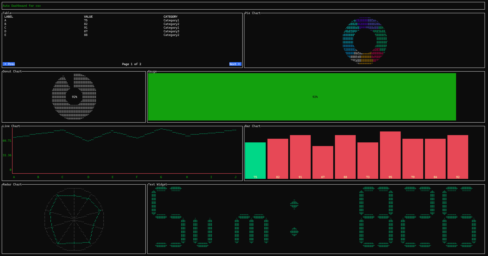

# 🪄 Datacmd: auto-generative dashboards from different sources in your CMD

**The Ultimate Terminal Dashboard**

> Turn any data source into a stunning interactive dashboard,  directly in your terminal. No fluff, no GUI, just pure terminal sorcery. ⚡

---

## Why you'll love Datacmd

Tired of bloated web UIs? `datacmd` brings data visualization back to where real devs live: **the terminal.**

- **One Command = Instant Dashboard**
- **Dynamic Widgets:** Tables, charts, gauges, pies, radars & more
- **Smart Layout Engine:** Auto-generates from data OR use YAML to customize
- **Real-Time Feeds:** From APIs, metrics, JSON, CSV
- **Zero Setup:** No deps, no bullshit,  just `go run`

> Think of it like `htop` meets `grafana`, but cooler and terminal-native.
>

It follows my obsession with data, which I developed by building **[https://datastripes.com](Datastripes)**, the web data engine that transform data analysis into simple flows.

---

## Demo

  
<sub>Realtime stock tracker via `datacmd --source=stock.json`</sub>

---

## 🧰 Installation (pick your style)

### Option 1: **Download prebuilt binary (Recommended)**

No setup, no Go, no stress.

> ✅ macOS · 🪟 Windows · 🐧 Linux

📦 Go to the [**Releases**](https://github.com/VincenzoManto/datacmd/releases) page and download the latest binary for your OS.

Then:

```bash
# macOS / Linux
chmod +x datacmd
./datacmd --generate --source=your-data.csv

# Windows
datacmd.exe --generate --source=your-data.csv
```

---

### Option 2: **Run from source (for Developers)**

```bash
git clone https://github.com/VincenzoManto/Datacmd.git
cd datacmd
go mod tidy
go run main.go --generate --source=your-data.csv
```


## How it works

```bash
# Auto-generate a dashboard from any CSV or JSON
datacmd --generate --source=./data.csv

# Or load your own layout
datacmd --config=dashboard.yml
```

Data sources supported:

* `.csv` 📂
* `.json` 📜
* REST APIs 🌐
* Live system metrics (CPU, RAM, disk) 🖥️

---

## Widgets you can use

* **Table** – Paginated, sortable
* **Gauge** – Perfect for usage stats, thresholds
* **Pie Chart** – Categorical comparisons
* **Line Chart** – Trends, time-series
* **Radar** – Multi-metric comparisons
* **Text Box** – Notes, alerts, logs
* **Number** – Big, bold KPIs
* **Funnel** – Visualize stages in a process
* **Scatter** – Correlation in dots
* **Histogram** – Numeric distribution

Customize via YAML, or let `--generate` do it all.

### Enhanced Gauge Widget

The gauge widget can be used to display aggregated values from your data. You can use the `aggregation` property to specify the aggregation type (`sum`, `avg`, `median`, `max`, `min`). The `max_value` property sets the upper bound for the gauge. If not provided, it's inferred from the data.

Here is an example of a gauge that shows the average CPU usage:

```yaml
- type: gauge
  title: "Average CPU Usage"
  value_col: "cpu_usage_percent"
  aggregation: "avg"
  max_value: 100
```

---

## Installation

```bash
git clone https://github.com/VincenzoManto/Datacmd.git
cd datacmd
go mod tidy
```

---

## Quick Start

### Example: `stock.json`

```json
[
  {"ticker": "AAPL", "price": 175.50, "volume": 1200000},
  {"ticker": "GOOG", "price": 140.25, "volume": 950000},
  {"ticker": "MSFT", "price": 280.75, "volume": 1500000}
]
```

```bash
go run main.go --generate --source=stock.json
```

Instantly shows:

* Table of stocks
* Volume gauges
* Market share pie chart

---

## YAML Customization

```yaml
layout:
  - type: table
    source: stock.json
    fields: [ticker, price, volume]

  - type: pie
    title: "Market Share"
    field: volume
```

> Your dashboard, your rules.

---

## 🧬 Inspired by Datastripes. Rebuilt for Power Users.

`datacmd` is the spiritual open source successor to [Datastripes](https://datastripes.com), reimagined with more muscle, more magic, and **zero fluff**.

---

## Linked resources

Based on `datacmd`, with the team @ Datatripes, we developed our complete and curated [toolkit for data analysis](https://github.com/Datastripes/the-data-analyst-toolkit)

## 🤝 Community

We’re building more than a CLI,  we’re starting a movement.
Star the repo ⭐, submit PRs, file issues, or just show us the wild dashboards you build.

---

## License

Apache 2.0,  free as in freedom and fast as in Go.

---

<p align="center">
  
  
  
  
</p>

<p align="center">
  <a href="https://star-history.com/#VincenzoManto/datacmd&Date">
    
  </a>
</p>


```txt

I built `datacmd`, a tool that turns CSV/JSON/API into live dashboards,  directly in your terminal

✅ No deps
🪄 Auto layout
⚡ One command

→ https://github.com/VincenzoManto/datacmd
